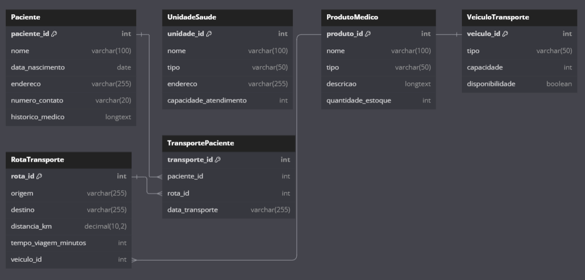
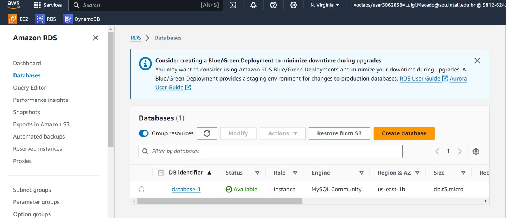
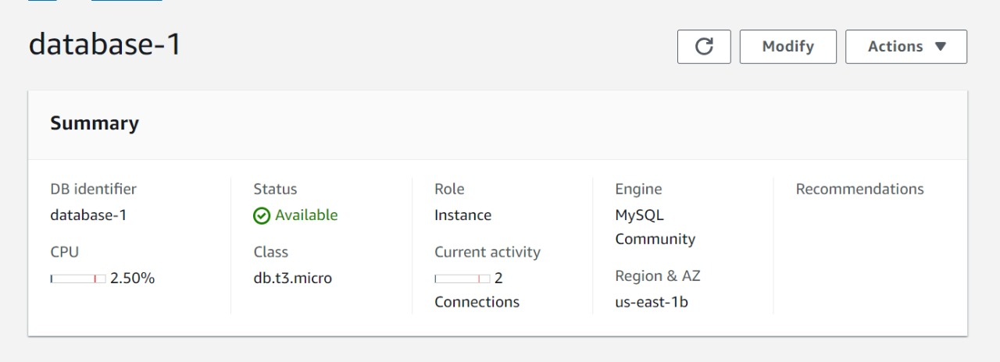
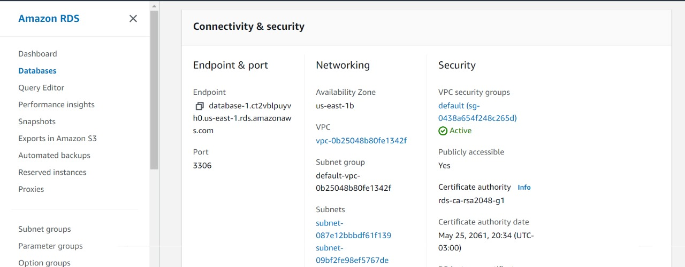
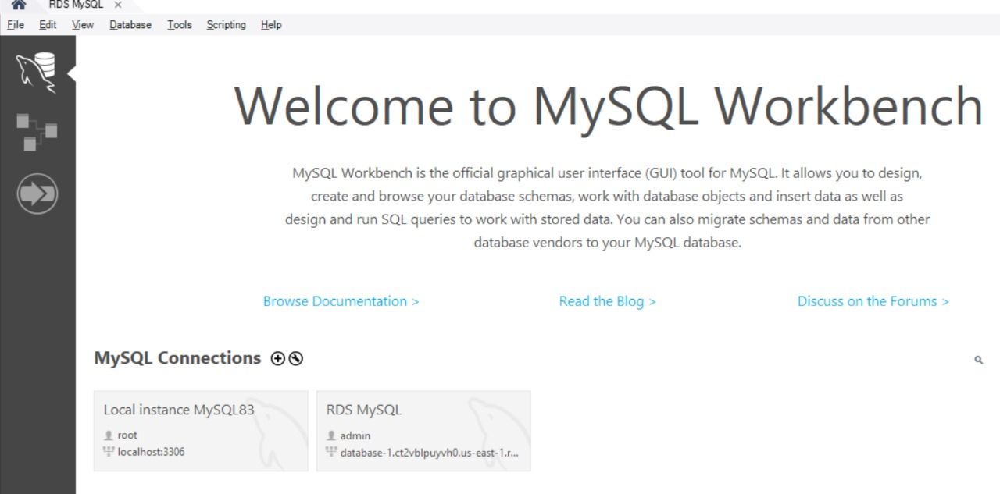
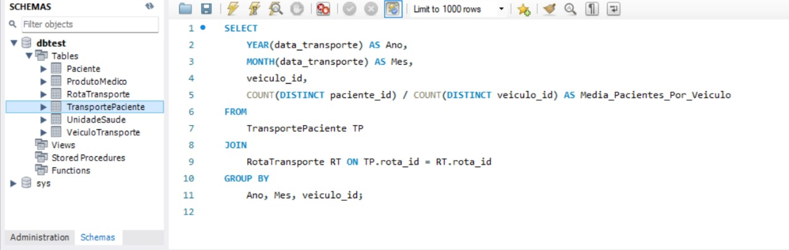
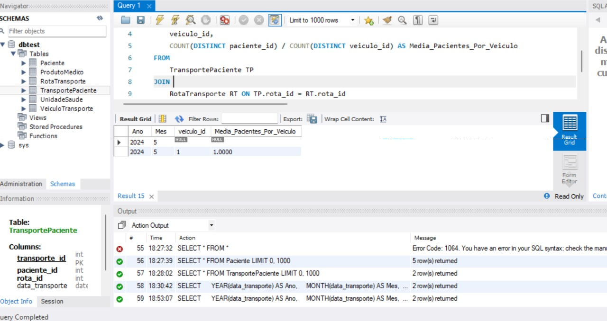

# ponderada3_RDS

Para atender aos requisitos solicitados, vamos seguir as etapas abaixo:

# 1. Modelo Lógico e Diagrama do Banco de Dados
Primeiro, vamos criar um modelo lógico simples para o problema proposto. Considerando que estamos lidando com um sistema de transporte de pacientes, podemos ter entidades como Veículo, Paciente, Transporte, e Registro de Transporte.

Modelo Lógico:
'''
Table Paciente {
  paciente_id int [pk]
  nome varchar(100)
  data_nascimento date
  endereco varchar(255)
  numero_contato varchar(20)
  historico_medico longtext
}

Table UnidadeSaude {
  unidade_id int [pk]
  nome varchar(100)
  tipo varchar(50)
  endereco varchar(255)
  capacidade_atendimento int
}

Table ProdutoMedico {
  produto_id int [pk]
  nome varchar(100)
  tipo varchar(50)
  descricao longtext
  quantidade_estoque int
}

Table VeiculoTransporte {
  veiculo_id int [pk]
  tipo varchar(50)
  capacidade int
  disponibilidade boolean
}

Table RotaTransporte {
  rota_id int [pk]
  origem varchar(255)
  destino varchar(255)
  distancia_km decimal(10, 2)
  tempo_viagem_minutos int
  veiculo_id int [ref: > VeiculoTransporte.veiculo_id]
}

Table TransportePaciente {
  transporte_id int [pk]
  paciente_id int [ref: > Paciente.paciente_id]
  rota_id int [ref: > RotaTransporte.rota_id]
  data_transporte varchar(255)
}
'''
# Modelo Lógico - Imagem

# Deploy no MySQL RDS da AWS
Acesse o Console AWS e vá para o serviço RDS.
Crie uma nova instância de banco de dados MySQL.
Configure os detalhes da instância (tipo de instância, capacidade, nome do banco de dados, etc.).
Garanta que a instância RDS tenha acesso adequado (por exemplo, ajuste grupos de segurança para permitir acesso a partir do local desejado).
Após a criação, conecte-se ao banco de dados usando um cliente MySQL (por exemplo, MySQL Workbench) e crie as tabelas com base no modelo lógico.

# Fluxo da ponderada
- Primeiro criei uma instância RDS na AWS
- Fiz o deploy do MySQL nessa RDS
- Desenhei um modelo lógico no papel
- Passei para o dbdiagram.io
- Adaptei as entidades e relacionamentos propostas acima ao diagrama
- Acessei meu banco de dados pelo MySQL Workbench
- Criei as tabelas com base nos modelos que eu desenhei
- Insiri todos os dados necessários nas tabelas para consultas
- Fiz a consulta

# Fluxo da ponderada - Imagens

